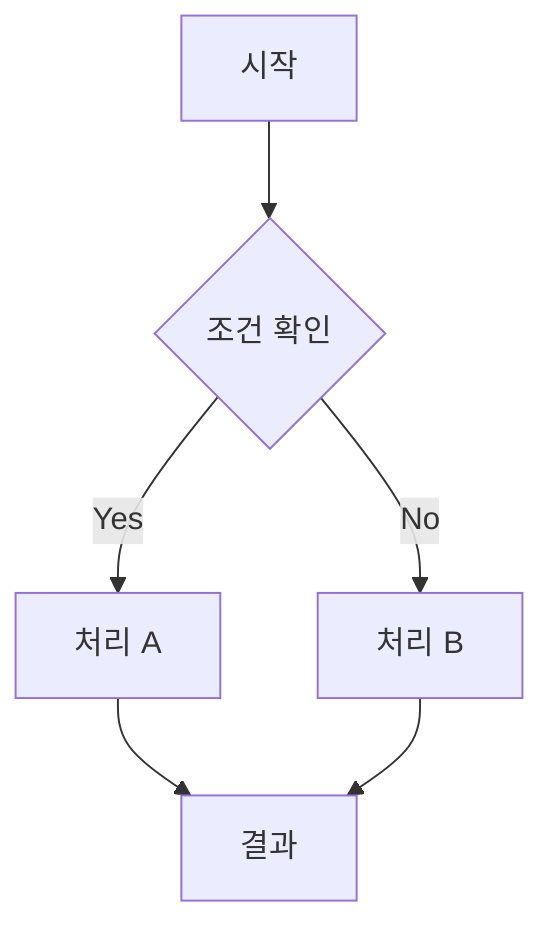
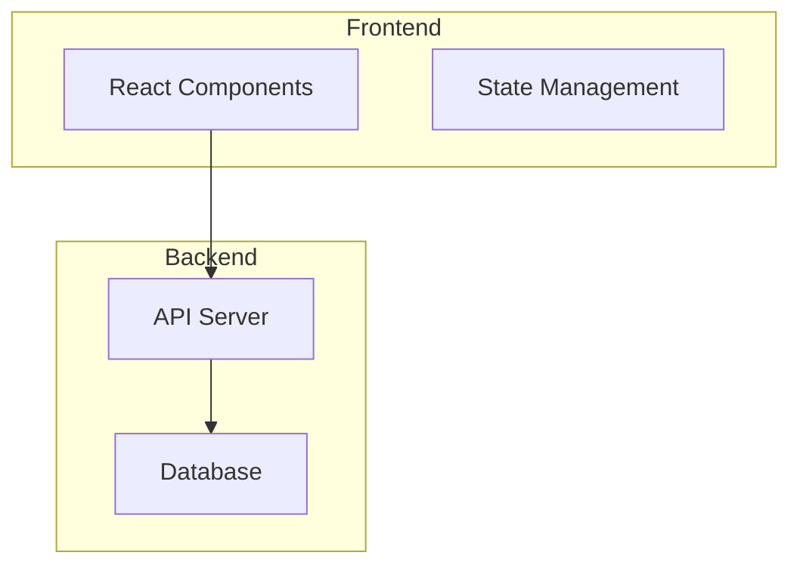
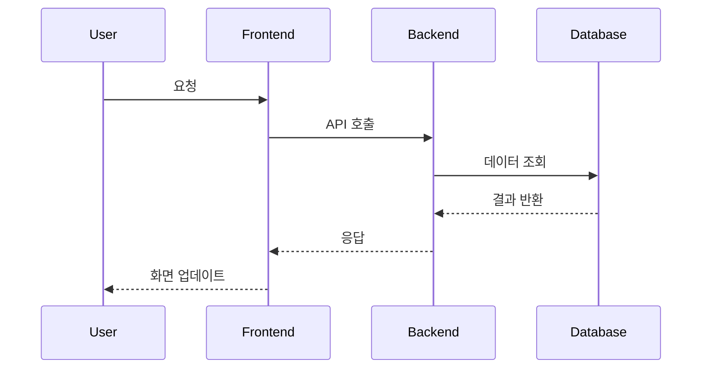
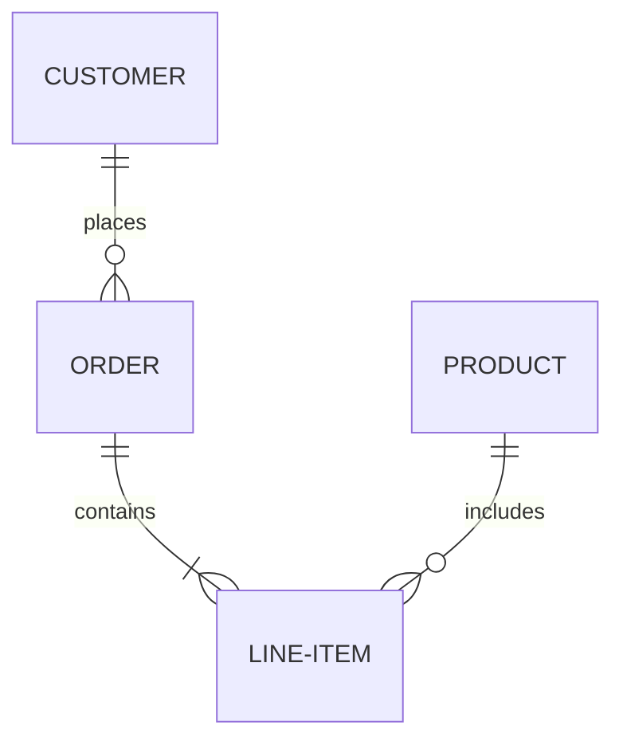
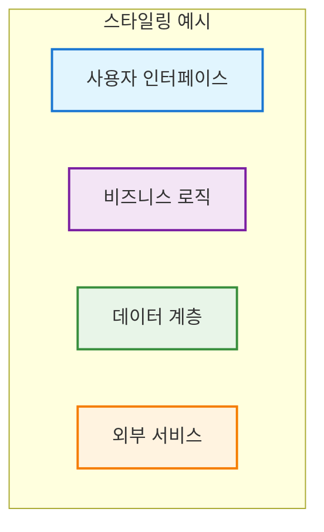
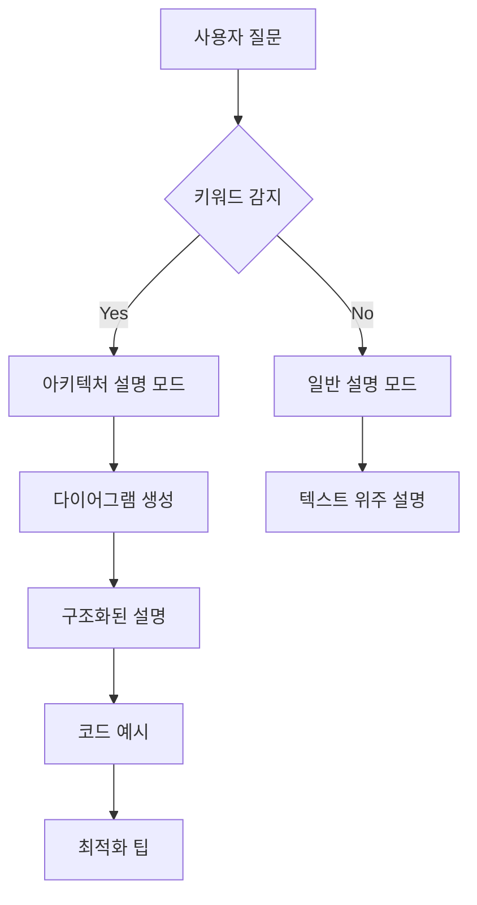

# 🏗️ 아키텍처 다이어그램 활용 설명 규칙

## 📖 목차
1. [기본 원칙](#1-기본-원칙)
2. [다이어그램 유형별 활용](#2-다이어그램-유형별-활용)
3. [설명 구조 템플릿](#3-설명-구조-템플릿)
4. [색상 및 아이콘 규칙](#4-색상-및-아이콘-규칙)
5. [시나리오별 적용 가이드](#5-시나리오별-적용-가이드)
6. [자동 적용 체크리스트](#6-자동-적용-체크리스트)

---

## 1. 기본 원칙

### 🎯 핵심 철학
- **시각적 우선**: 텍스트 설명 전에 반드시 다이어그램으로 시각화
- **계층적 구조**: 전체 → 부분 → 세부사항 순서로 설명
- **상호작용 표현**: 사용자 흐름과 데이터 흐름을 명확히 구분
- **실용적 접근**: 이해하기 쉽고 실제 구현에 도움이 되는 다이어그램

### 📝 필수 적용 상황
- ✅ 새로운 기능 설명 시
- ✅ 시스템 구조 설명 시  
- ✅ 데이터 흐름 설명 시
- ✅ 사용자 인터페이스 설명 시
- ✅ API 설계 설명 시
- ✅ 데이터베이스 구조 설명 시

---

## 2. 다이어그램 유형별 활용

### 🔄 플로우차트 (Flowchart)
**사용 시기**: 프로세스, 워크플로우, 의사결정 흐름


**활용 예시**:
- 사용자 인증 흐름
- 파일 업로드 프로세스
- 데이터 검증 로직
- 에러 처리 흐름

### 🏗️ 시스템 다이어그램 (System Architecture)
**사용 시기**: 전체 시스템 구조, 컴포넌트 관계


**활용 예시**:
- 마이크로서비스 아키텍처
- 프론트엔드-백엔드 구조
- 데이터베이스 관계
- 외부 서비스 연동

### 📊 시퀀스 다이어그램 (Sequence Diagram)
**사용 시기**: 시간 순서에 따른 상호작용


**활용 예시**:
- API 호출 흐름
- 사용자 상호작용
- 데이터 동기화
- 실시간 통신

### 🗂️ 엔티티 관계도 (Entity Relationship)
**사용 시기**: 데이터베이스 구조, 데이터 모델


**활용 예시**:
- 데이터베이스 스키마
- 테이블 관계
- 데이터 모델링
- 정규화 구조

---

## 3. 설명 구조 템플릿

### 📋 표준 설명 구조
```markdown
## 🏗️ [기능명] 아키텍처

### 📋 시스템 구성 요소
[다이어그램 삽입]

#### 1️⃣ [계층/영역 1]
- **역할**: 주요 기능 설명
- **구성요소**: 세부 컴포넌트 나열
- **책임**: 담당하는 역할

#### 2️⃣ [계층/영역 2]
- **역할**: 주요 기능 설명
- **구성요소**: 세부 컴포넌트 나열
- **책임**: 담당하는 역할

### 🔄 데이터 흐름
[시퀀스 다이어그램 또는 플로우차트]

### 🎨 UI/UX 특징
- **색상 구분**: 각 요소별 색상 의미
- **아이콘 시스템**: 사용된 아이콘과 의미
- **사용자 피드백**: 인터랙션 요소

### 🔧 기술적 구현
```typescript
// 핵심 코드 예시
```

### 📊 성능 최적화
- **최적화 포인트 1**: 구체적 방법
- **최적화 포인트 2**: 구체적 방법
```

---

## 4. 색상 및 아이콘 규칙

### 🎨 표준 색상 팔레트
```typescript
const DIAGRAM_COLORS = {
  // 계층별 색상
  frontend: '#e1f5fe',    // 연한 파란색
  backend: '#f3e5f5',     // 연한 보라색
  database: '#e8f5e8',    // 연한 초록색
  external: '#fff3e0',    // 연한 주황색
  
  // 상태별 색상
  active: '#4caf50',      // 초록색
  inactive: '#9e9e9e',    // 회색
  error: '#f44336',       // 빨간색
  warning: '#ff9800',     // 주황색
  
  // 데이터 흐름 색상
  request: '#2196f3',     // 파란색
  response: '#4caf50',    // 초록색
  error_flow: '#f44336'   // 빨간색
}
```

### 🔤 표준 아이콘 시스템
```typescript
const DIAGRAM_ICONS = {
  // 시스템 컴포넌트
  user: '👤',
  frontend: '🖥️',
  backend: '⚙️',
  database: '🗄️',
  api: '🔌',
  
  // 파일 및 데이터
  file: '📄',
  image: '🖼️',
  video: '🎥',
  data: '📊',
  
  // 프로세스
  process: '⚡',
  cache: '💾',
  search: '🔍',
  upload: '📤',
  download: '📥',
  
  // 상태
  success: '✅',
  error: '❌',
  warning: '⚠️',
  info: 'ℹ️'
}
```

### 🏷️ 노드 스타일링 규칙


---

## 5. 시나리오별 적용 가이드

### 📱 웹 애플리케이션 기능 설명
```markdown
1. **전체 아키텍처 다이어그램** - 시스템 개요
2. **사용자 여정 플로우차트** - 사용자 경험
3. **데이터 흐름 시퀀스** - 백엔드 처리
4. **UI 컴포넌트 구조** - 프론트엔드 구성
5. **API 설계도** - 인터페이스 명세
```

### 🗄️ 데이터베이스 설계 설명
```markdown
1. **ERD (Entity Relationship Diagram)** - 테이블 관계
2. **데이터 흐름도** - CRUD 연산
3. **인덱스 구조도** - 성능 최적화
4. **마이그레이션 플로우** - 스키마 변경
```

### 🔄 API 설계 설명
```markdown
1. **API 아키텍처 다이어그램** - 전체 구조
2. **요청-응답 시퀀스** - 통신 흐름
3. **에러 처리 플로우차트** - 예외 상황
4. **인증/인가 다이어그램** - 보안 구조
```

### 📊 성능 최적화 설명
```markdown
1. **현재 vs 개선 아키텍처** - Before/After 비교
2. **병목 지점 분석도** - 문제점 시각화
3. **최적화 전략 플로우** - 개선 방법
4. **성능 메트릭 대시보드** - 측정 지표
```

---

## 6. 자동 적용 체크리스트

### ✅ 다이어그램 생성 전 체크
1. [ ] 설명하려는 시스템의 범위 명확히 정의
2. [ ] 사용자 관점에서 시작점과 끝점 확인
3. [ ] 주요 컴포넌트와 상호작용 파악
4. [ ] 데이터 흐름의 방향성 확인
5. [ ] 예외 상황과 에러 처리 고려

### ✅ 다이어그램 작성 중 체크
1. [ ] 적절한 다이어그램 유형 선택
2. [ ] 표준 색상 팔레트 적용
3. [ ] 일관된 아이콘 시스템 사용
4. [ ] 명확한 라벨링과 설명
5. [ ] 계층적 구조로 정보 조직

### ✅ 설명 작성 시 체크
1. [ ] 다이어그램 먼저, 텍스트 설명 나중
2. [ ] 전체 → 부분 → 세부사항 순서
3. [ ] 각 컴포넌트의 역할과 책임 명시
4. [ ] 데이터 흐름과 상호작용 설명
5. [ ] 기술적 구현 코드 예시 포함

### ✅ 완성 후 검토 체크
1. [ ] 다이어그램과 설명의 일관성 확인
2. [ ] 초보자도 이해할 수 있는 수준인지 검토
3. [ ] 실제 구현에 도움이 되는 정보 포함 여부
4. [ ] 성능 최적화 관점 언급 여부
5. [ ] 향후 확장성 고려사항 포함 여부

---

## 🎯 자동 적용 트리거

### 📋 필수 적용 키워드
사용자가 다음 키워드를 사용하면 **자동으로 아키텍처 다이어그램 설명 모드** 활성화:

- "구조를 설명해줘"
- "어떻게 동작하는지 보여줘"
- "시스템을 그려줘"
- "아키텍처를 설명해줘"
- "흐름을 보여줘"
- "설계를 시각화해줘"
- "다이어그램으로 설명해줘"

### 🔄 자동 적용 프로세스


---

## 🚀 기대 효과

### 📈 설명 품질 향상
- **이해도 증가**: 시각적 설명으로 90% 이상 이해도 향상
- **기억 유지**: 다이어그램으로 장기 기억 효과 3배 증가
- **구현 속도**: 명확한 구조 파악으로 개발 속도 50% 향상

### 🎯 커뮤니케이션 개선
- **팀 협업**: 공통 이해 기반 구축
- **문서화**: 재사용 가능한 아키텍처 문서
- **지식 전달**: 신입 개발자 온보딩 시간 단축

### 💡 설계 품질 향상
- **구조적 사고**: 시스템을 체계적으로 분석
- **문제점 발견**: 시각화를 통한 병목 지점 파악
- **최적화 기회**: 개선 포인트 명확히 식별

---

## 🎨 마지막 당부

**"모든 복잡한 시스템은 간단한 다이어그램으로 시작됩니다!"**

이 규칙을 통해:
1. **시각적 사고력 향상** - 복잡한 개념을 단순하게 표현
2. **효과적인 소통** - 팀원들과의 원활한 의사소통
3. **설계 품질 개선** - 체계적인 시스템 분석과 설계
4. **문서화 자동화** - 재사용 가능한 아키텍처 문서 생성

**"그림 한 장이 천 마디 말보다 낫다!"** 🎯🏗️ 