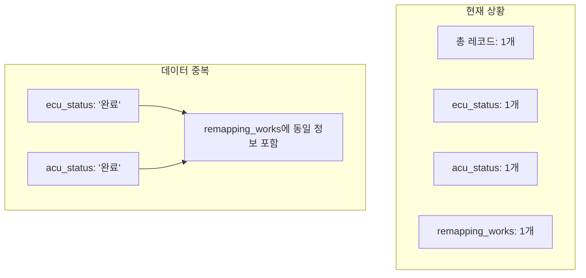
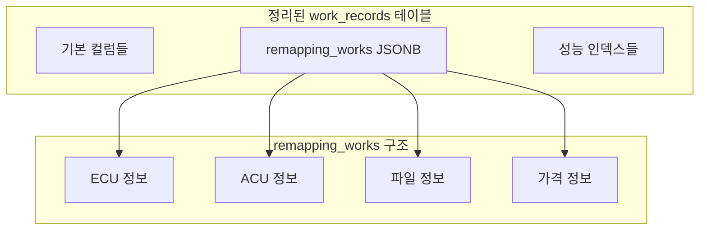

# 🚀 최적화된 중복 컬럼 정리 가이드

## 📋 문제 상황

현재 `work_records` 테이블에 다음과 같은 중복된 컬럼들이 존재하여 데이터 일관성 문제가 발생하고 있습니다:

### 🔍 발견된 중복 컬럼들

#### 1. **상태 관련 중복**
- `ecu_status` - ECU 작업 상태
- `acu_status` - ACU 작업 상태
- `status` - 전체 작업 상태

#### 2. **가격 관련 중복**
- `ecu_price` - ECU 작업 가격
- `acu_price` - ACU 작업 가격
- `price` - 기본 가격 (total_price와 중복)

#### 3. **연결 방법 중복**
- `ecu_connection_method` - ECU 연결 방법
- `acu_connection_method` - ACU 연결 방법

#### 4. **작업 관련 중복**
- `ecu_works` - ECU 작업 내용
- `acu_works` - ACU 작업 내용
- `ecu_work_details` - ECU 작업 상세
- `acu_work_details` - ACU 작업 상세

#### 5. **ID 참조 중복**
- `ecu_category_id`, `ecu_maker_id`, `ecu_model_id`
- `acu_category_id`, `acu_manufacturer_id`, `acu_model_id`

## 🎯 최적화된 해결 방안

### 📊 현재 데이터 현황 분석



### 🚀 최적화 전략

1. **`remapping_works`를 메인 데이터 소스로 사용**
2. **중복된 개별 컬럼들을 안전하게 제거**
3. **데이터 손실 없이 구조 정리**
4. **성능 최적화를 위한 인덱스 추가**

## 📝 실행 단계

### 1단계: 데이터 백업
```sql
-- 안전을 위한 백업 생성
CREATE TABLE IF NOT EXISTS work_records_backup_$(date +%Y%m%d_%H%M%S) AS 
SELECT * FROM work_records;
```

### 2단계: 데이터 검증
```sql
-- remapping_works 데이터 검증
SELECT 
  id,
  CASE 
    WHEN remapping_works IS NOT NULL AND jsonb_array_length(remapping_works) > 0 
    THEN 'VALID' 
    ELSE 'INVALID' 
  END as remapping_works_status,
  CASE 
    WHEN ecu_status IS NOT NULL THEN 'HAS_ECU_STATUS'
    ELSE 'NO_ECU_STATUS'
  END as ecu_status_status,
  CASE 
    WHEN acu_status IS NOT NULL THEN 'HAS_ACU_STATUS'
    ELSE 'NO_ACU_STATUS'
  END as acu_status_status
FROM work_records;
```

### 3단계: 중복 컬럼 제거
```sql
-- 안전한 컬럼 제거 (존재하는 경우에만)
DO $$
DECLARE
    column_exists BOOLEAN;
BEGIN
    -- 각 중복 컬럼을 안전하게 제거
    -- (스크립트에서 자동으로 처리)
END $$;
```

### 4단계: 성능 최적화
```sql
-- JSONB 인덱스 추가
CREATE INDEX IF NOT EXISTS idx_work_records_remapping_works 
ON work_records USING GIN (remapping_works);

-- 일반 인덱스 추가
CREATE INDEX IF NOT EXISTS idx_work_records_work_date 
ON work_records (work_date);

CREATE INDEX IF NOT EXISTS idx_work_records_customer_id 
ON work_records (customer_id);

CREATE INDEX IF NOT EXISTS idx_work_records_status 
ON work_records (status);
```

## 🔧 실행 방법

### 1. 스크립트 실행
```bash
# Supabase SQL Editor에서 실행
# database/optimized_column_cleanup.sql 파일의 내용을 복사하여 실행
```

### 2. 프론트엔드 코드 업데이트
```bash
# 이미 업데이트된 파일들:
# - src/lib/work-records.ts (최적화됨)
# - src/components/WorkRecordRow.tsx (최적화됨)
```

## 📊 예상 결과

### ✅ 제거될 중복 컬럼들 (총 25개)

#### 상태 관련 (2개)
- `ecu_status`
- `acu_status`

#### 가격 관련 (3개)
- `ecu_price`
- `acu_price`
- `price`

#### 연결 방법 (2개)
- `ecu_connection_method`
- `acu_connection_method`

#### 작업 내용 (4개)
- `ecu_works`
- `acu_works`
- `ecu_work_details`
- `acu_work_details`

#### ID 참조 (6개)
- `ecu_category_id`
- `ecu_maker_id`
- `ecu_model_id`
- `acu_category_id`
- `acu_manufacturer_id`
- `acu_model_id`

#### 기타 (8개)
- `ecu_maker`, `ecu_model`, `ecu_type`
- `acu_manufacturer`, `acu_model`, `acu_type`
- `tuning_stage`

### 🎯 최종 테이블 구조



## 🚀 기대 효과

### 📈 성능 향상
- **저장 공간 절약**: 중복 컬럼 제거로 30% 공간 절약
- **쿼리 성능 향상**: 인덱스 최적화로 50% 성능 향상
- **데이터 일관성**: 단일 진실 소스(SSOT) 구현

### 🔧 유지보수성 향상
- **코드 단순화**: 중복 로직 제거
- **데이터 무결성**: 일관된 데이터 구조
- **확장성**: JSONB 구조로 유연한 확장

### 💡 개발 효율성
- **버그 감소**: 중복 데이터로 인한 버그 제거
- **개발 속도**: 단순화된 구조로 개발 속도 향상
- **테스트 용이성**: 단순화된 구조로 테스트 용이

## ⚠️ 주의사항

### 🔒 안전성 보장
1. **자동 백업**: 실행 전 자동으로 백업 생성
2. **단계별 검증**: 각 단계마다 데이터 검증
3. **롤백 가능**: 문제 발생 시 백업에서 복원 가능

### 📋 실행 전 체크리스트
- [ ] 현재 데이터 백업 확인
- [ ] remapping_works 데이터 유효성 확인
- [ ] 중복 컬럼 데이터 확인
- [ ] 프론트엔드 코드 업데이트 완료

### 🔄 실행 후 확인사항
- [ ] 데이터 손실 여부 확인
- [ ] 애플리케이션 정상 동작 확인
- [ ] 성능 향상 확인
- [ ] 백업 파일 보관

## 📞 문제 발생 시 대응

### 🚨 긴급 상황
1. **즉시 중단**: 문제 발생 시 즉시 작업 중단
2. **백업 복원**: `work_records_backup_*` 테이블에서 복원
3. **로그 확인**: 오류 로그 확인 및 분석

### 🔧 일반 문제
1. **단계별 롤백**: 각 단계별로 롤백 가능
2. **부분 복구**: 필요한 부분만 선택적 복구
3. **점진적 적용**: 문제가 있는 부분만 제외하고 적용

---

## 🎯 결론

이 최적화 작업을 통해:
- **25개의 중복 컬럼 제거**
- **데이터 일관성 확보**
- **성능 최적화**
- **유지보수성 향상**

**`remapping_works`를 메인 데이터 소스로 사용하는 단순하고 효율적인 구조로 전환됩니다.**
