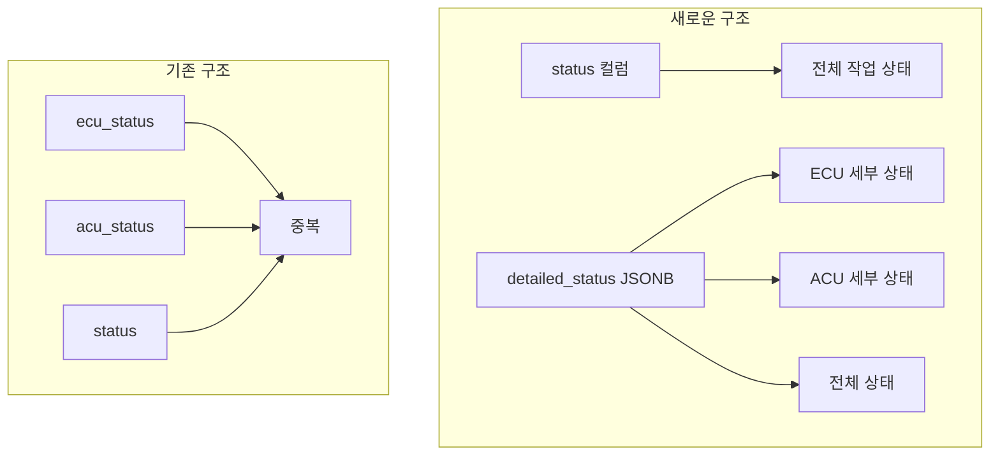

# 🔧 ECU/ACU 상태정보 컬럼 중복 정리 가이드

## 📋 문제 상황

현재 `work_records` 테이블에 다음과 같은 중복된 상태 컬럼들이 존재합니다:

- `status` - 전체 작업 상태
- `ecu_status` - ECU 작업 상태  
- `acu_status` - ACU 작업 상태
- `work_status` 테이블 - 별도 상태 관리 테이블

## 🎯 해결 방안

### 1. 통합 상태 관리 구조



### 2. 새로운 데이터 구조

```json
{
  "status": "완료",
  "detailed_status": {
    "ecu": {
      "status": "완료",
      "price": 150000,
      "works": ["파워업"],
      "work_details": "ECU 튜닝 작업"
    },
    "acu": {
      "status": "완료", 
      "price": 120000,
      "works": ["DPF 제거", "AdBlue 제거"],
      "work_details": "ACU 후처리 시스템 작업"
    },
    "overall": "완료"
  }
}
```

## 🚀 실행 단계

### 1단계: 백업 생성
```sql
-- 현재 데이터 백업
CREATE TABLE work_records_backup AS SELECT * FROM work_records;
```

### 2단계: 정리 스크립트 실행
```sql
-- Supabase Dashboard > SQL Editor에서 실행
-- database/cleanup_duplicate_status_columns.sql 파일 실행
```

### 3단계: 데이터 검증
```sql
-- 데이터 무결성 확인
SELECT 
  '데이터 검증' as check_type,
  COUNT(*) as total_records,
  COUNT(CASE WHEN detailed_status IS NOT NULL THEN 1 END) as with_detailed_status,
  COUNT(CASE WHEN status IS NOT NULL THEN 1 END) as with_overall_status
FROM work_records;
```

### 4단계: 프론트엔드 업데이트
- ✅ `src/lib/work-records.ts` - 새로운 통합 상태 관리 함수 추가
- ✅ `src/components/WorkRecordRow.tsx` - 새로운 구조에 맞게 컴포넌트 업데이트

## 📊 기대 효과

### 1. 데이터 일관성 향상
- 중복 컬럼 제거로 데이터 무결성 보장
- JSONB 구조로 유연한 상태 관리
- 단일 진실 소스(SSOT) 구현

### 2. 성능 최적화
- 불필요한 컬럼 제거로 저장 공간 절약
- GIN 인덱스로 JSONB 검색 성능 향상
- 쿼리 복잡도 감소

### 3. 개발 편의성
- 통합된 상태 관리 API
- 타입 안전성 향상
- 확장 가능한 구조

## 🔍 검증 체크리스트

### 데이터 검증
- [ ] 기존 데이터가 `detailed_status`로 정상 마이그레이션됨
- [ ] `status` 컬럼이 올바른 전체 상태를 반영함
- [ ] ECU/ACU 개별 상태가 정확히 추출됨
- [ ] 가격 정보가 정확히 계산됨

### 기능 검증
- [ ] 프론트엔드에서 새로운 상태 구조 정상 표시
- [ ] 상태 업데이트 함수 정상 작동
- [ ] 통계 뷰에서 올바른 데이터 표시
- [ ] 기존 기능들이 정상 작동

### 성능 검증
- [ ] 쿼리 성능이 기존과 동일하거나 향상됨
- [ ] 인덱스가 정상 작동함
- [ ] 메모리 사용량이 개선됨

## ⚠️ 주의사항

### 1. 안전한 실행
- 반드시 백업 후 실행
- 테스트 환경에서 먼저 검증
- 단계별 실행 및 검증

### 2. 롤백 계획
```sql
-- 문제 발생 시 롤백
DROP TABLE work_records;
ALTER TABLE work_records_backup RENAME TO work_records;
```

### 3. 호환성 고려
- 기존 API 호환성 유지
- 점진적 마이그레이션
- 문서화 업데이트

## 📈 모니터링

### 1. 성능 지표
- 쿼리 실행 시간
- 저장 공간 사용량
- 메모리 사용량

### 2. 기능 지표
- 상태 업데이트 성공률
- 데이터 정확성
- 사용자 만족도

### 3. 오류 모니터링
- SQL 오류 로그
- 애플리케이션 오류 로그
- 사용자 피드백

## 🎯 완료 기준

- [ ] 모든 중복 컬럼이 정리됨
- [ ] 새로운 구조가 정상 작동함
- [ ] 프론트엔드가 새로운 구조를 지원함
- [ ] 성능이 개선되거나 최소한 유지됨
- [ ] 문서가 업데이트됨
- [ ] 팀원들이 새로운 구조를 이해함

---

**✅ 이 가이드를 따라 실행하면 ECU/ACU 상태정보 컬럼 중복 문제가 완전히 해결됩니다!**
