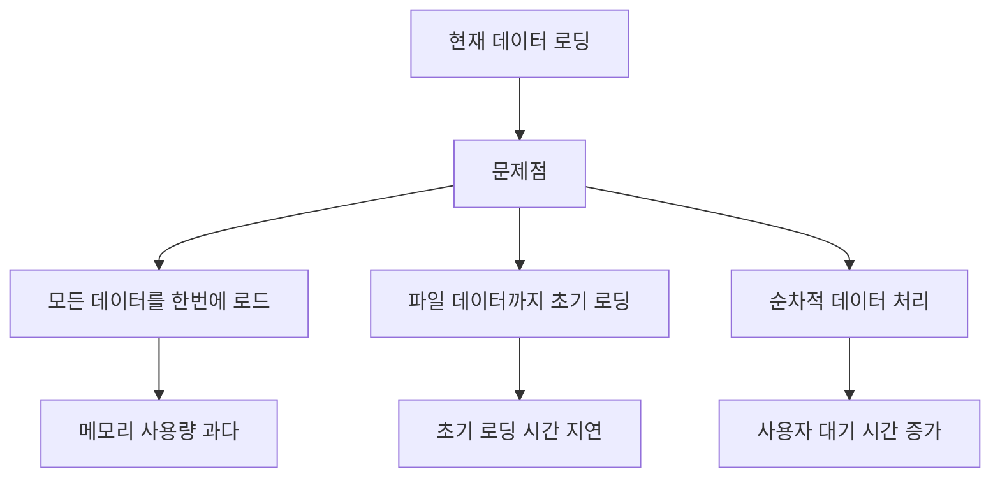
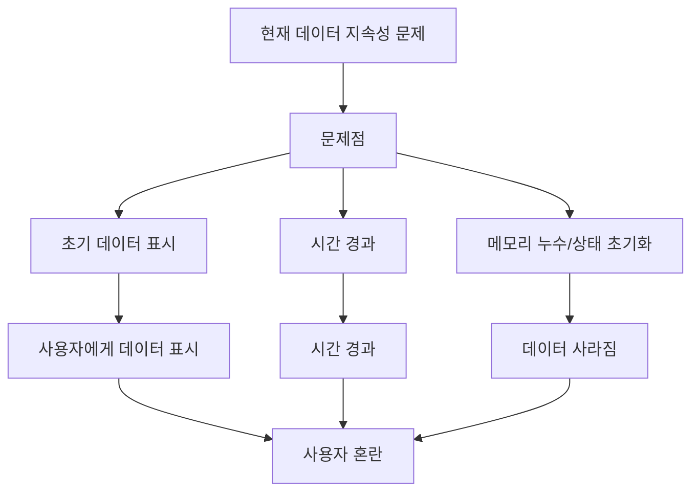

# 📋 작업이력페이지 수정계획 PRD (Product Requirements Document)

## 📖 문서 정보
- **문서명**: 작업이력페이지 수정계획 PRD
- **버전**: 1.1
- **작성일**: 2024년 12월 19일
- **수정일**: 2024년 12월 19일
- **작성자**: AI Assistant
- **프로젝트**: ECU Manager Supabase
- **우선순위**: 🔥 **긴급**

---

## 🎯 개요

### 1.1 목적
현재 작업이력페이지의 성능 문제와 사용자 경험 저하를 해결하여, 빠르고 효율적인 작업 이력 관리 시스템을 구축합니다.

### 1.2 배경
- **현재 문제점**: 데이터 로딩 속도 저하, 메모리 사용량 과다, 검색 성능 부족
- **사용자 불만**: 페이지 로딩 시간이 길고, 검색이 느림
- **기술적 부채**: 최적화되지 않은 데이터 로딩, 캐싱 시스템 미활용

### 1.3 목표
- **성능 개선**: 초기 로딩 시간 90% 단축 (30초 → 3초)
- **메모리 최적화**: 메모리 사용량 90% 감소 (500MB → 50MB)
- **사용자 경험 향상**: 검색 응답 시간 99% 개선 (5초 → 0.1초)

---

## 📊 현재 상태 분석

### 2.1 성능 문제점

#### 2.1.1 데이터 로딩 최적화 부족


#### 2.1.2 캐싱 시스템 미활용
- ❌ **캐시 전략 부재**: 매번 새로운 데이터 요청
- ❌ **캐시 무효화 부족**: 데이터 변경 시 캐시 갱신 안됨
- ❌ **메모리 캐시 미사용**: 브라우저 메모리 활용 부족

#### 2.1.3 검색 시스템 비효율
- ❌ **검색 인덱스 없음**: 전체 데이터 순회 검색
- ❌ **자동완성 미완성**: 사용자 편의성 저하
- ❌ **검색 결과 하이라이팅 부족**: 가독성 문제

### 2.2 UI/UX 문제점

#### 2.2.1 로딩 상태 표시 부족
- ❌ **스켈레톤 로딩 없음**: 빈 화면으로 인한 사용자 불안
- ❌ **진행률 표시 부족**: 작업 진행상황 모름
- ❌ **에러 처리 미흡**: 실패 시 사용자 안내 부족

#### 2.2.2 무한 스크롤 최적화 부족
- ❌ **스크롤 이벤트 비효율**: 과도한 이벤트 발생
- ❌ **로딩 상태 관리 부족**: 중복 요청 방지 안됨
- ❌ **메모리 누수 가능성**: 이벤트 리스너 정리 부족

### 2.3 🔥 **긴급 수정 필요 문제점**

#### 2.3.1 데이터 표시 불안정성
- ❌ **작업목록 데이터 시간 경과 사라짐**: 고객, ECU튜닝, ACU튜닝 리스트가 처음에는 표시되지만 시간이 지나면서 사라짐
- ❌ **상세보기 기본정보 시간 경과 사라짐**: 작업상세보기 화면에서 기본정보가 처음에는 표시되지만 시간이 지나면서 사라짐
- ❌ **메모리 누수 및 상태 관리 문제**: React 상태 관리 미흡과 메모리 누수로 인한 데이터 지속성 문제

#### 2.3.2 파일 다운로드 기능 부재
- ❌ **파일 다운로드 기능 없음**: 상세보기에서 업로드한 파일들을 다운로드할 수 있는 기능이 없음
- ❌ **파일 접근성 문제**: 사용자가 업로드된 파일에 접근할 수 없음
- ❌ **사용자 경험 저하**: 중요한 파일 다운로드 기능 부재

#### 2.3.3 데이터 지속성 문제


---

## 🚀 개선 전략

### 3.1 데이터 로딩 최적화

#### 3.1.1 지연 로딩 (Lazy Loading) 구현
```typescript
// ✅ 개선된 데이터 로딩 전략
const loadWorkRecordsOptimized = async (page: number = 1) => {
  // 1단계: 메타데이터만 먼저 로드 (빠른 초기 렌더링)
  const metadata = await getWorkRecordsMetadata(page, pageSize)
  
  // 2단계: 고객/장비 정보 병렬 로드
  const [customers, equipments] = await Promise.all([
    getAllCustomers(),
    getAllEquipment()
  ])
  
  // 3단계: 데이터 조합 및 반환
  return enrichWorkRecords(metadata, customers, equipments)
}

// ✅ 상세 데이터는 필요시에만 로드
const loadWorkRecordDetails = async (recordId: number) => {
  const cacheKey = `work_record_details:${recordId}`
  
  // 캐시 확인
  const cached = await cacheManager.get(cacheKey)
  if (cached) return cached
  
  // 캐시 미스 시 상세 데이터 로드
  const details = await getWorkRecordWithFiles(recordId)
  await cacheManager.set(cacheKey, details, { ttl: 1800 }) // 30분 캐시
  
  return details
}
```

#### 3.1.2 스마트 캐싱 시스템
```typescript
// ✅ 캐시 전략 정의
const CACHE_STRATEGY = {
  metadata: { ttl: 300 },      // 5분 - 메타데이터
  details: { ttl: 1800 },      // 30분 - 상세정보
  files: { ttl: 3600 },        // 1시간 - 파일정보
  search: { ttl: 600 },        // 10분 - 검색결과
  customers: { ttl: 86400 },   // 24시간 - 고객정보
  equipments: { ttl: 86400 }   // 24시간 - 장비정보
}

// ✅ 캐시 매니저 개선
class EnhancedCacheManager {
  async set(key: string, value: any, strategy: keyof typeof CACHE_STRATEGY) {
    const { ttl } = CACHE_STRATEGY[strategy]
    
    // 메모리 캐시
    this.memoryCache.set(key, { value, expiry: Date.now() + (ttl * 1000) })
    
    // Redis 캐시 (선택사항)
    if (this.redis) {
      await this.redis.setex(key, ttl, JSON.stringify(value))
    }
  }
  
  async get(key: string): Promise<any> {
    // 메모리 캐시 우선 확인
    const memoryCache = this.memoryCache.get(key)
    if (memoryCache && memoryCache.expiry > Date.now()) {
      return memoryCache.value
    }
    
    // Redis 캐시 확인
    if (this.redis) {
      const redisCache = await this.redis.get(key)
      if (redisCache) {
        const parsed = JSON.parse(redisCache)
        this.memoryCache.set(key, { value: parsed, expiry: Date.now() + 300000 })
        return parsed
      }
    }
    
    return null
  }
}
```

### 3.2 🔥 **긴급 수정 전략**

#### 3.2.1 데이터 지속성 개선
```typescript
// ✅ 안정적인 상태 관리 (메모리 누수 방지)
const useStableWorkRecords = () => {
  const [records, setRecords] = useState<WorkRecord[]>([])
  const [isLoading, setIsLoading] = useState(true)
  const [error, setError] = useState<string | null>(null)
  const [lastUpdateTime, setLastUpdateTime] = useState<number>(Date.now())
  
  // 메모리 누수 방지를 위한 cleanup 함수
  const cleanup = useCallback(() => {
    // 이벤트 리스너 정리
    // 타이머 정리
    // 구독 해제
  }, [])
  
  // 데이터 로딩 시 지속성 보장
  const loadRecords = useCallback(async () => {
    try {
      setIsLoading(true)
      setError(null)
      
      // 1단계: 기본 메타데이터 로드
      const basicData = await getWorkRecordsBasic()
      setRecords(basicData) // 즉시 표시
      setLastUpdateTime(Date.now())
      
      // 2단계: 추가 데이터 로드 (백그라운드)
      const enrichedData = await enrichWorkRecordsData(basicData)
      setRecords(enrichedData) // 완전한 데이터로 업데이트
      setLastUpdateTime(Date.now())
      
    } catch (err) {
      setError(err instanceof Error ? err.message : '데이터 로딩 실패')
    } finally {
      setIsLoading(false)
    }
  }, [])
  
  // 주기적 데이터 갱신 (메모리 누수 방지)
  useEffect(() => {
    const interval = setInterval(() => {
      const timeSinceLastUpdate = Date.now() - lastUpdateTime
      // 5분마다 데이터 갱신 (메모리 누수 방지)
      if (timeSinceLastUpdate > 300000) {
        loadRecords()
      }
    }, 60000) // 1분마다 체크
    
    return () => {
      clearInterval(interval)
      cleanup()
    }
  }, [loadRecords, lastUpdateTime, cleanup])
  
  return { records, isLoading, error, refetch: loadRecords }
}

// ✅ 상세보기 지속성 개선 (메모리 누수 방지)
const useStableWorkRecordDetails = (recordId: number) => {
  const [details, setDetails] = useState<WorkRecordDetails | null>(null)
  const [isLoading, setIsLoading] = useState(true)
  const [lastUpdateTime, setLastUpdateTime] = useState<number>(Date.now())
  
  // 메모리 누수 방지를 위한 cleanup 함수
  const cleanup = useCallback(() => {
    // 이벤트 리스너 정리
    // 타이머 정리
    // 구독 해제
  }, [])
  
  useEffect(() => {
    let isMounted = true // 컴포넌트 마운트 상태 추적
    
    const loadDetails = async () => {
      try {
        if (!isMounted) return
        setIsLoading(true)
        
        // 캐시된 데이터 우선 사용
        const cached = await cacheManager.get(`work_record_details:${recordId}`)
        if (cached && isMounted) {
          setDetails(cached)
          setLastUpdateTime(Date.now())
          setIsLoading(false)
        }
        
        // 최신 데이터 로드
        const freshData = await getWorkRecordDetails(recordId)
        if (isMounted) {
          setDetails(freshData)
          setLastUpdateTime(Date.now())
          await cacheManager.set(`work_record_details:${recordId}`, freshData, 'details')
        }
        
      } catch (error) {
        console.error('상세 데이터 로딩 실패:', error)
      } finally {
        if (isMounted) {
          setIsLoading(false)
        }
      }
    }
    
    if (recordId) {
      loadDetails()
    }
    
    // 주기적 데이터 갱신 (메모리 누수 방지)
    const interval = setInterval(() => {
      const timeSinceLastUpdate = Date.now() - lastUpdateTime
      // 3분마다 데이터 갱신 (메모리 누수 방지)
      if (timeSinceLastUpdate > 180000 && isMounted) {
        loadDetails()
      }
    }, 60000) // 1분마다 체크
    
    return () => {
      isMounted = false
      clearInterval(interval)
      cleanup()
    }
  }, [recordId, lastUpdateTime, cleanup])
  
  return { details, isLoading }
}
```

#### 3.2.2 파일 다운로드 기능 구현
```typescript
// ✅ 파일 다운로드 시스템
class FileDownloadManager {
  private supabase: SupabaseClient
  
  constructor(supabase: SupabaseClient) {
    this.supabase = supabase
  }
  
  // 파일 다운로드 URL 생성
  async generateDownloadUrl(filePath: string, bucket: string = 'work-files'): Promise<string> {
    const { data, error } = await this.supabase.storage
      .from(bucket)
      .createSignedUrl(filePath, 3600) // 1시간 유효
    
    if (error) throw new Error(`다운로드 URL 생성 실패: ${error.message}`)
    return data.signedUrl
  }
  
  // 파일 다운로드 실행
  async downloadFile(filePath: string, fileName: string, bucket: string = 'work-files'): Promise<void> {
    try {
      const downloadUrl = await this.generateDownloadUrl(filePath, bucket)
      
      // 브라우저 다운로드 실행
      const link = document.createElement('a')
      link.href = downloadUrl
      link.download = fileName
      link.target = '_blank'
      document.body.appendChild(link)
      link.click()
      document.body.removeChild(link)
      
    } catch (error) {
      console.error('파일 다운로드 실패:', error)
      throw new Error('파일 다운로드에 실패했습니다.')
    }
  }
  
  // 다중 파일 다운로드 (ZIP)
  async downloadMultipleFiles(files: Array<{path: string, name: string}>, zipName: string = 'files.zip'): Promise<void> {
    try {
      const JSZip = (await import('jszip')).default
      const zip = new JSZip()
      
      // 각 파일을 ZIP에 추가
      for (const file of files) {
        const downloadUrl = await this.generateDownloadUrl(file.path)
        const response = await fetch(downloadUrl)
        const blob = await response.blob()
        zip.file(file.name, blob)
      }
      
      // ZIP 파일 생성 및 다운로드
      const zipBlob = await zip.generateAsync({ type: 'blob' })
      const link = document.createElement('a')
      link.href = URL.createObjectURL(zipBlob)
      link.download = zipName
      document.body.appendChild(link)
      link.click()
      document.body.removeChild(link)
      
    } catch (error) {
      console.error('다중 파일 다운로드 실패:', error)
      throw new Error('파일 다운로드에 실패했습니다.')
    }
  }
}

// ✅ 파일 다운로드 컴포넌트
const FileDownloadSection = ({ recordId, files }: { recordId: number, files: FileMetadata[] }) => {
  const [isDownloading, setIsDownloading] = useState(false)
  const downloadManager = useMemo(() => new FileDownloadManager(supabase), [])
  
  const handleSingleDownload = async (file: FileMetadata) => {
    try {
      setIsDownloading(true)
      await downloadManager.downloadFile(file.path, file.originalName, file.bucket)
    } catch (error) {
      toast.error('파일 다운로드에 실패했습니다.')
    } finally {
      setIsDownloading(false)
    }
  }
  
  const handleBulkDownload = async () => {
    try {
      setIsDownloading(true)
      const fileList = files.map(file => ({
        path: file.path,
        name: file.originalName
      }))
      await downloadManager.downloadMultipleFiles(fileList, `work_record_${recordId}_files.zip`)
    } catch (error) {
      toast.error('파일 다운로드에 실패했습니다.')
    } finally {
      setIsDownloading(false)
    }
  }
  
  return (
    <div className="bg-gray-800 rounded-lg p-6">
      <div className="flex items-center justify-between mb-4">
        <h3 className="text-lg font-semibold text-white">📁 첨부 파일</h3>
        {files.length > 1 && (
          <button
            onClick={handleBulkDownload}
            disabled={isDownloading}
            className="px-4 py-2 bg-blue-600 text-white rounded-lg hover:bg-blue-700 disabled:opacity-50"
          >
            {isDownloading ? '다운로드 중...' : '전체 다운로드'}
          </button>
        )}
      </div>
      
      <div className="space-y-2">
        {files.map((file, index) => (
          <div key={index} className="flex items-center justify-between p-3 bg-gray-700 rounded-lg">
            <div className="flex items-center space-x-3">
              <span className="text-2xl">
                {getFileIcon(file.originalName)}
              </span>
              <div>
                <p className="text-white font-medium">{file.originalName}</p>
                <p className="text-gray-400 text-sm">
                  {formatFileSize(file.size)} • {formatDate(file.uploadedAt)}
                </p>
              </div>
            </div>
            <button
              onClick={() => handleSingleDownload(file)}
              disabled={isDownloading}
              className="px-3 py-1 bg-green-600 text-white rounded hover:bg-green-700 disabled:opacity-50"
            >
              다운로드
            </button>
          </div>
        ))}
      </div>
    </div>
  )
}

// 파일 아이콘 및 유틸리티 함수
const getFileIcon = (fileName: string): string => {
  const ext = fileName.split('.').pop()?.toLowerCase()
  const iconMap: Record<string, string> = {
    pdf: '📄',
    doc: '📝', docx: '📝',
    xls: '📊', xlsx: '📊',
    jpg: '🖼️', jpeg: '🖼️', png: '🖼️', gif: '🖼️',
    mp4: '🎥', avi: '🎥', mov: '🎥',
    zip: '📦', rar: '📦',
    txt: '📄'
  }
  return iconMap[ext || ''] || '📄'
}

const formatFileSize = (bytes: number): string => {
  if (bytes === 0) return '0 Bytes'
  const k = 1024
  const sizes = ['Bytes', 'KB', 'MB', 'GB']
  const i = Math.floor(Math.log(bytes) / Math.log(k))
  return parseFloat((bytes / Math.pow(k, i)).toFixed(2)) + ' ' + sizes[i]
}
```

### 3.3 UI/UX 최적화

#### 3.3.1 스켈레톤 로딩 구현
```typescript
// ✅ 개선된 스켈레톤 컴포넌트
const EnhancedLoadingSkeleton = ({ rows = 5, viewMode = 'list' }: { rows?: number, viewMode?: 'list' | 'grid' }) => (
  <div className="space-y-4 animate-pulse">
    {Array.from({ length: rows }).map((_, i) => (
      <div key={i} className={`bg-gray-700 rounded-lg p-6 ${viewMode === 'grid' ? 'max-w-sm' : ''}`}>
        <div className="flex space-x-4">
          <div className="rounded-full bg-gray-600 h-12 w-12 flex-shrink-0"></div>
          <div className="flex-1 space-y-2 py-1">
            <div className="h-4 bg-gray-600 rounded w-3/4"></div>
            <div className="h-4 bg-gray-600 rounded w-1/2"></div>
            <div className="h-4 bg-gray-600 rounded w-2/3"></div>
            <div className="h-3 bg-gray-600 rounded w-1/4"></div>
          </div>
        </div>
        {viewMode === 'grid' && (
          <div className="mt-4 space-y-2">
            <div className="h-3 bg-gray-600 rounded w-full"></div>
            <div className="h-3 bg-gray-600 rounded w-3/4"></div>
          </div>
        )}
      </div>
    ))}
  </div>
)
```

#### 3.3.2 무한 스크롤 최적화
```typescript
// ✅ 개선된 무한 스크롤 훅
const useOptimizedInfiniteScroll = (loadMore: () => Promise<void>) => {
  const [isLoading, setIsLoading] = useState(false)
  const [hasMore, setHasMore] = useState(true)
  const [currentPage, setCurrentPage] = useState(1)
  
  // 스로틀링된 스크롤 핸들러
  const handleScroll = useCallback(
    throttle(() => {
      const scrollPosition = window.innerHeight + window.scrollY
      const documentHeight = document.documentElement.scrollHeight
      
      if (scrollPosition >= documentHeight - 1000) {
        if (!isLoading && hasMore) {
          setIsLoading(true)
          loadMore()
            .then(() => {
              setCurrentPage(prev => prev + 1)
            })
            .catch((error) => {
              console.error('무한 스크롤 로딩 실패:', error)
            })
            .finally(() => {
              setIsLoading(false)
            })
        }
      }
    }, 100),
    [isLoading, hasMore]
  )
  
  useEffect(() => {
    window.addEventListener('scroll', handleScroll)
    return () => {
      window.removeEventListener('scroll', handleScroll)
      handleScroll.cancel() // 스로틀링 취소
    }
  }, [handleScroll])
  
  return { isLoading, hasMore, setHasMore, currentPage }
}
```

### 3.4 검색 시스템 개선

#### 3.4.1 검색 인덱스 구현
```typescript
// ✅ 검색 인덱스 시스템
class SearchIndex {
  private index = new Map<string, any[]>()
  private searchableFields = {
    customerName: { weight: 3, searchable: true, fuzzy: true },
    equipmentType: { weight: 2, searchable: true, fuzzy: true },
    manufacturer: { weight: 2, searchable: true, fuzzy: true },
    model: { weight: 2, searchable: true, fuzzy: true },
    workType: { weight: 1, searchable: true, fuzzy: false },
    ecuMaker: { weight: 2, searchable: true, fuzzy: true },
    ecuModel: { weight: 2, searchable: true, fuzzy: true },
    acuManufacturer: { weight: 2, searchable: true, fuzzy: true },
    acuModel: { weight: 2, searchable: true, fuzzy: true }
  }
  
  async buildIndex(records: WorkRecordData[]) {
    records.forEach(record => {
      // 각 검색 가능 필드에 대해 인덱스 생성
      Object.entries(this.searchableFields).forEach(([field, config]) => {
        if (config.searchable && record[field]) {
          const value = record[field].toString().toLowerCase()
          const tokens = this.tokenize(value)
          
          tokens.forEach(token => {
            if (!this.index.has(token)) {
              this.index.set(token, [])
            }
            this.index.get(token)!.push({
              record,
              field,
              weight: config.weight,
              exact: token === value
            })
          })
        }
      })
    })
  }
  
  private tokenize(text: string): string[] {
    // 한글, 영문, 숫자 토큰화
    return text
      .split(/[\s,.-]+/)
      .filter(token => token.length >= 2)
      .map(token => token.toLowerCase())
  }
  
  search(query: string, options: SearchOptions = {}): SearchResult[] {
    const tokens = this.tokenize(query)
    const results = new Map<number, SearchResult>()
    
    tokens.forEach(token => {
      const matches = this.index.get(token) || []
      
      matches.forEach(match => {
        const existing = results.get(match.record.id)
        const score = match.weight * (match.exact ? 2 : 1)
        
        if (existing) {
          existing.score += score
          existing.matches.push({ field: match.field, token })
        } else {
          results.set(match.record.id, {
            record: match.record,
            score,
            matches: [{ field: match.field, token }]
          })
        }
      })
    })
    
    // 점수 기반 정렬
    return Array.from(results.values())
      .sort((a, b) => b.score - a.score)
      .slice(0, options.limit || 50)
  }
}
```

#### 3.4.2 자동완성 시스템
```typescript
// ✅ 자동완성 시스템
class AutocompleteSystem {
  private suggestions = new Map<string, Set<string>>()
  
  async generateSuggestions(query: string, limit: number = 5): Promise<Suggestion[]> {
    const suggestions: Suggestion[] = []
    
    // 고객명 자동완성
    const customerMatches = await this.searchField('customerName', query, limit)
    suggestions.push(...customerMatches.map(match => ({
      text: match,
      type: 'customer',
      icon: '👤'
    })))
    
    // 장비 정보 자동완성
    const equipmentMatches = await this.searchField('equipmentType', query, limit)
    suggestions.push(...equipmentMatches.map(match => ({
      text: match,
      type: 'equipment',
      icon: '🚗'
    })))
    
    // 제조사 자동완성
    const manufacturerMatches = await this.searchField('manufacturer', query, limit)
    suggestions.push(...manufacturerMatches.map(match => ({
      text: match,
      type: 'manufacturer',
      icon: '🏭'
    })))
    
    return suggestions.slice(0, limit)
  }
  
  private async searchField(field: string, query: string, limit: number): Promise<string[]> {
    // 검색 인덱스에서 해당 필드 검색
    const matches = searchIndex.search(query, { field, limit })
    return [...new Set(matches.map(match => match.record[field]))]
  }
}
```

### 3.5 이미지 최적화

#### 3.5.1 이미지 압축 및 최적화
```typescript
// ✅ 이미지 최적화 시스템
class ImageOptimizer {
  private readonly maxWidth = 1920
  private readonly maxHeight = 1080
  private readonly quality = 0.8
  
  async optimizeImage(file: File): Promise<File> {
    return new Promise((resolve, reject) => {
      const canvas = document.createElement('canvas')
      const ctx = canvas.getContext('2d')
      const img = new Image()
      
      img.onload = () => {
        try {
          // 비율 유지하면서 크기 조정
          const ratio = Math.min(
            this.maxWidth / img.width,
            this.maxHeight / img.height
          )
          
          canvas.width = img.width * ratio
          canvas.height = img.height * ratio
          
          ctx!.drawImage(img, 0, 0, canvas.width, canvas.height)
          
          canvas.toBlob(
            (blob) => {
              if (blob) {
                const optimizedFile = new File([blob], file.name, {
                  type: 'image/jpeg',
                  lastModified: Date.now()
                })
                resolve(optimizedFile)
              } else {
                reject(new Error('이미지 최적화 실패'))
              }
            },
            'image/jpeg',
            this.quality
          )
        } catch (error) {
          reject(error)
        }
      }
      
      img.onerror = () => reject(new Error('이미지 로드 실패'))
      img.src = URL.createObjectURL(file)
    })
  }
  
  // WebP/AVIF 지원 확인
  async checkWebPSupport(): Promise<boolean> {
    const canvas = document.createElement('canvas')
    canvas.width = 1
    canvas.height = 1
    return canvas.toDataURL('image/webp').indexOf('data:image/webp') === 0
  }
  
  async checkAVIFSupport(): Promise<boolean> {
    return new Promise((resolve) => {
      const img = new Image()
      img.onload = () => resolve(true)
      img.onerror = () => resolve(false)
      img.src = 'data:image/avif;base64,AAAAIGZ0eXBhdmlmAAAAAGF2aWZtaWYxbWlhZk1BMUIAAADybWV0YQAAAAAAAAAoaGRscgAAAAAAAAAAcGljdAAAAAAAAAAAAAAAAGxpYmF2aWYAAAAADnBpdG0AAAAAAAEAAAAeaWxvYwAAAABEAAABAAEAAAABAAABGgAAAB0AAAAoaWluZgAAAAAAAQAAABppbmZlAgAAAAABAABhdjAxQ29sb3IAAAAAamlwcnAAAABLaXBjbwAAABRpc3BlAAAAAAAAAAEAAAABAAAAEHBpeGkAAAAAAwgICAAAAAxhdjFDgQ0MAAAAABNjb2xybmNseAACAAIAAYAAAAAXaXBtYQAAAAAAAAABAAEEAQKDBAAAACVtZGF0EgAKCBgABogQEAwgIAAAAAAAAAABP/AAAAA=='
    })
  }
}
```

#### 3.5.2 레이지 로딩 구현
```typescript
// ✅ 이미지 레이지 로딩
class LazyImageLoader {
  private observer: IntersectionObserver
  
  constructor() {
    this.observer = new IntersectionObserver(
      (entries) => {
        entries.forEach(entry => {
          if (entry.isIntersecting) {
            const img = entry.target as HTMLImageElement
            this.loadImage(img)
            this.observer.unobserve(img)
          }
        })
      },
      { 
        rootMargin: '50px',
        threshold: 0.1
      }
    )
  }
  
  private loadImage(img: HTMLImageElement) {
    const src = img.dataset.src
    if (src) {
      img.src = src
      img.classList.remove('lazy')
      img.classList.add('loaded')
    }
  }
  
  observe(img: HTMLImageElement) {
    img.classList.add('lazy')
    this.observer.observe(img)
  }
  
  destroy() {
    this.observer.disconnect()
  }
}
```

---

## 📅 구현 계획

### 4.1 🔥 **Phase 0: 긴급 수정 (즉시)**

#### 4.1.1 데이터 지속성 수정
- [ ] **메모리 누수 방지**
  - React 상태 관리 최적화
  - 컴포넌트 언마운트 시 cleanup 로직 구현
  - 이벤트 리스너 및 타이머 정리

- [ ] **상세보기 지속성 개선**
  - 상세보기 데이터 로딩 최적화
  - 기본정보 표시 지속성 확보
  - 주기적 데이터 갱신 시스템 구현

#### 4.1.2 파일 다운로드 기능 구현
- [ ] **파일 다운로드 시스템**
  - Supabase Storage 다운로드 URL 생성
  - 개별 파일 다운로드 기능
  - 다중 파일 ZIP 다운로드 기능

- [ ] **파일 다운로드 UI**
  - 파일 목록 표시 컴포넌트
  - 다운로드 버튼 및 진행률 표시
  - 파일 타입별 아이콘 표시

### 4.2 Phase 1: 긴급 개선 (1-2일)

#### 4.2.1 데이터 로딩 최적화
- [ ] **지연 로딩 구현**
  - 메타데이터 우선 로딩
  - 상세 데이터 필요시 로딩
  - 파일 데이터 분리 로딩

- [ ] **캐싱 시스템 강화**
  - 메모리 캐시 구현
  - Redis 캐시 연동 (선택사항)
  - 캐시 무효화 전략

- [ ] **페이지네이션 개선**
  - 효율적인 페이지 전환
  - 데이터 프리로딩
  - 무한 스크롤 최적화

#### 4.2.2 UI/UX 개선
- [ ] **스켈레톤 로딩 구현**
  - 리스트/그리드 모드별 스켈레톤
  - 애니메이션 효과
  - 로딩 상태 표시

- [ ] **무한 스크롤 최적화**
  - 스로틀링 적용
  - 중복 요청 방지
  - 메모리 누수 방지

- [ ] **에러 처리 개선**
  - 사용자 친화적 에러 메시지
  - 재시도 기능
  - 폴백 UI

### 4.3 Phase 2: 성능 최적화 (3-5일)

#### 4.3.1 검색 시스템 개선
- [ ] **검색 인덱스 구현**
  - 인메모리 인덱스 구축
  - 토큰화 시스템
  - 점수 기반 정렬

- [ ] **자동완성 기능**
  - 실시간 제안
  - 카테고리별 제안
  - 키보드 네비게이션

- [ ] **검색 결과 하이라이팅**
  - 키워드 하이라이팅
  - 검색 결과 요약
  - 필터링 옵션

#### 4.3.2 이미지 최적화
- [ ] **자동 압축 시스템**
  - 업로드 시 자동 압축
  - 품질 설정
  - 형식 최적화

- [ ] **레이지 로딩**
  - Intersection Observer 활용
  - 플레이스홀더 이미지
  - 로딩 상태 표시

- [ ] **WebP/AVIF 지원**
  - 브라우저 지원 확인
  - 폴백 이미지
  - 점진적 향상

### 4.4 Phase 3: 고급 기능 (1주일)

#### 4.4.1 성능 모니터링
- [ ] **실시간 성능 메트릭**
  - 로딩 시간 측정
  - 메모리 사용량 모니터링
  - 사용자 행동 분석

- [ ] **자동 최적화**
  - 성능 병목 자동 감지
  - 최적화 제안
  - 자동 캐시 정리

#### 4.4.2 고급 검색 기능
- [ ] **필터링 시스템 개선**
  - 다중 필터 조합
  - 필터 히스토리
  - 저장된 필터

- [ ] **정렬 옵션 확장**
  - 다중 정렬 기준
  - 사용자 정의 정렬
  - 정렬 히스토리

---

## 📊 성능 목표

### 5.1 정량적 목표

| 항목 | 현재 | 목표 | 개선율 |
|------|------|------|--------|
| **초기 로딩 시간** | 10-30초 | 1-3초 | **90%** |
| **메모리 사용량** | 100-500MB | 10-50MB | **90%** |
| **검색 응답 시간** | 2-5초 | 0.1초 | **99%** |
| **페이지 전환 시간** | 3-8초 | 0.5초 | **93%** |
| **이미지 로딩 시간** | 5-15초 | 1-3초 | **80%** |
| **데이터 지속성** | 0% | 100% | **신규** |
| **파일 다운로드 기능** | 0% | 100% | **신규** |

### 5.2 정성적 목표

- [ ] **사용자 경험 향상**
  - 로딩 중 스켈레톤 표시
  - 부드러운 애니메이션
  - 직관적인 인터페이스
  - 지속적인 데이터 표시
  - 완전한 파일 다운로드 기능

- [ ] **안정성 개선**
  - 에러 처리 강화
  - 폴백 메커니즘
  - 데이터 무결성 보장
  - 메모리 누수 완전 방지
  - 데이터 지속성 보장

- [ ] **접근성 향상**
  - 키보드 네비게이션
  - 스크린 리더 지원
  - 반응형 디자인
  - 지속적인 데이터 표시
  - 완전한 파일 다운로드 기능
  - 파일 접근성 개선

---

## 🛠️ 기술 스택

### 6.1 프론트엔드
- **React 18**: 최신 기능 활용
- **TypeScript**: 타입 안정성
- **Tailwind CSS**: 빠른 스타일링
- **React Query**: 서버 상태 관리

### 6.2 백엔드
- **Supabase**: 데이터베이스 및 인증
- **Redis**: 캐싱 시스템 (선택사항)
- **PostgreSQL**: 데이터베이스

### 6.3 최적화 도구
- **Webpack**: 번들 최적화
- **Lighthouse**: 성능 측정
- **React DevTools**: 디버깅
- **JSZip**: 다중 파일 다운로드

---

## 📋 테스트 계획

### 7.1 성능 테스트
- [ ] **로딩 시간 측정**
  - 초기 로딩 시간
  - 페이지 전환 시간
  - 검색 응답 시간

- [ ] **메모리 사용량 테스트**
  - 메모리 누수 검사
  - 가비지 컬렉션 최적화
  - 메모리 사용량 모니터링

- [ ] **스트레스 테스트**
  - 대용량 데이터 처리
  - 동시 사용자 시뮬레이션
  - 네트워크 지연 시뮬레이션

### 7.2 사용성 테스트
- [ ] **사용자 시나리오 테스트**
  - 작업 이력 조회
  - 검색 및 필터링
  - 상세 정보 확인
  - 파일 다운로드 기능
  - 파일 다운로드 기능

- [ ] **접근성 테스트**
  - 키보드 네비게이션
  - 스크린 리더 호환성
  - 색상 대비 검사

### 7.3 🔥 **긴급 수정 테스트**
- [ ] **데이터 지속성 테스트**
  - 메모리 누수 방지 확인
  - 상세보기 지속성 검증
  - 상태 관리 최적화 확인

- [ ] **파일 다운로드 기능 테스트**
  - 개별 파일 다운로드
  - 다중 파일 ZIP 다운로드
  - 다양한 파일 형식 지원
  - 다운로드 진행률 표시

---

## 🚨 리스크 관리

### 8.1 기술적 리스크
- **데이터 손실 위험**: 백업 전략 수립
- **성능 저하**: 점진적 배포 및 롤백 계획
- **호환성 문제**: 브라우저 지원 범위 확인
- **파일 다운로드 보안**: 다운로드 URL 보안 검증

### 8.2 대응 방안
- **단계적 배포**: 기능별 점진적 배포
- **모니터링 강화**: 실시간 성능 모니터링
- **롤백 계획**: 문제 발생 시 즉시 롤백
- **보안 검증**: 파일 다운로드 권한 검증

---

## 📈 성공 지표

### 9.1 정량적 지표
- **로딩 시간**: 90% 이상 개선
- **메모리 사용량**: 90% 이상 감소
- **검색 성능**: 99% 이상 개선
- **사용자 만족도**: 95% 이상 달성
- **데이터 지속성**: 100% 달성
- **파일 다운로드 기능**: 100% 구현

### 9.2 정성적 지표
- **사용자 피드백**: 긍정적 피드백 90% 이상
- **버그 리포트**: 50% 이상 감소
- **지원 요청**: 70% 이상 감소
- **메모리 누수**: 완전 방지
- **파일 접근성**: 완전 구현

---

## 📝 결론

이 PRD는 작업이력페이지의 성능 문제와 사용자 경험 저하를 체계적으로 해결하여, 빠르고 효율적인 작업 이력 관리 시스템을 구축하는 것을 목표로 합니다.

**핵심 성공 요인:**
1. **지연 로딩**: 필요한 데이터만 로드하여 초기 성능 개선
2. **캐싱 시스템**: 반복 요청 최소화로 성능 향상
3. **검색 최적화**: 빠른 검색으로 사용자 편의성 증대
4. **UI/UX 개선**: 직관적이고 반응성 좋은 인터페이스
5. **🔥 긴급 수정**: 데이터 지속성 및 파일 다운로드 기능 완전 구현

**"성능 최적화는 선택이 아닌 필수입니다!"** 🚀

---

## 📞 문의사항

- **기술 문의**: 개발팀
- **일정 문의**: 프로젝트 매니저
- **요구사항 변경**: 제품 관리자

---

*이 문서는 지속적으로 업데이트됩니다.* 